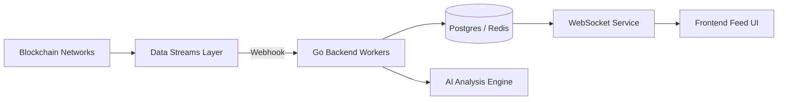

# ChainFeed (Coming Soon) ⛓️

像刷 Twitter 一样追踪链上活动 —— 专注于 Web3 链上数据的实时信息流平台。

> 概念演示 (Coming Soon) • 项目文档 (Coming Soon)

---

## 📖 项目愿景（Overview）

在 Web3 世界，链上数据虽然公开透明，但对普通开发者和投资者而言依然存在“信息围墙”。ChainFeed 旨在打破这一壁垒。

我们构建一个高性能的后端索引层，将复杂的链上交易（Logs / Events）解析为人类可读的社交化信息流。用户只需关注特定地址（如巨鲸、KOL 或机构），即可实时掌握其资产流转与交互动态。

## 核心价值

- **实时性**：通过 WebSocket 建立长连接，保证链上动态的秒级感知。
- **可读性**：使用 AI（GPT-4o 等）自动解析复杂交易逻辑，将十六进制数据转换为自然语言摘要。
- **专注性**：聚焦以太坊主网，深度解析链上活动与交互模式。

## ✨ 规划功能（Planned Features）

### 1.0 MVP

- 智能关注管理：地址标签、ENS 解析与批量监控。
- 实时 Feed 流：覆盖 ETH、ERC-20 转账与 NFT（ERC-721）交易。
- AI 交易摘要：为复杂合约交互生成简短精准的中文说明。
- 以太坊主网深度解析：专注单链，提供最精准的链上活动监控。

### 进阶功能

- 异常行为监测：大额异动告警与批量授权风险预警。
- 链上关系图谱：分析地址间资金往来与关联性。
- 数据导出 API：为开发者提供实时数据推送服务。

## 🏗️ 技术架构（Architecture Design）

本项目追求高并发处理能力与良好的可观测性，核心组件包括后台索引器、AI 解析引擎、以及实时推送层。

### 技术栈

- **后端**：Go 1.22 + Gin，使用 goroutine 处理并发任务。
- **前端**：Next.js 14 + TailwindCSS，响应式 Feed UI。
- **存储/缓存**：PostgreSQL（持久化）+ Redis（Pub/Sub 与缓存）。
- **数据源**：Alchemy Webhooks + go-ethereum（RPC 深度交互）。
- **智能解析**：Dify + OpenAI GPT-4o。

### 数据流（示意）

## 📊 技术难点（Engineering Challenges）

- **高并发下的数据一致性**：在高频 Webhook 推送场景，如何通过 Redis 队列和幂等策略保证入库顺序与准确性。
- **智能合约解析**：深度解析以太坊主网复杂合约交互，提供精准的交易语义理解。
- **低延迟推送**：优化 WebSocket 服务端的内存与连接管理，支撑大量实时连接。

## 📅 项目路线图（Roadmap）

- [x] 阶段 1：架构设计与技术选型
- [ ] 阶段 2：后端索引层与数据库建模（进行中）
- [ ] 阶段 3：AI 解析引擎与 Dify 工作流集成（规划中）
- [ ] 阶段 4：前端 UI 开发与 WebSocket 联调（规划中）

## ✉️ 联系方式

如果你对本项目感兴趣或希望参与协作，欢迎联系：

- Email: bwm029@gmail.com

---

ChainFeed — 洞察链上脉搏，让复杂数据触手可及。
